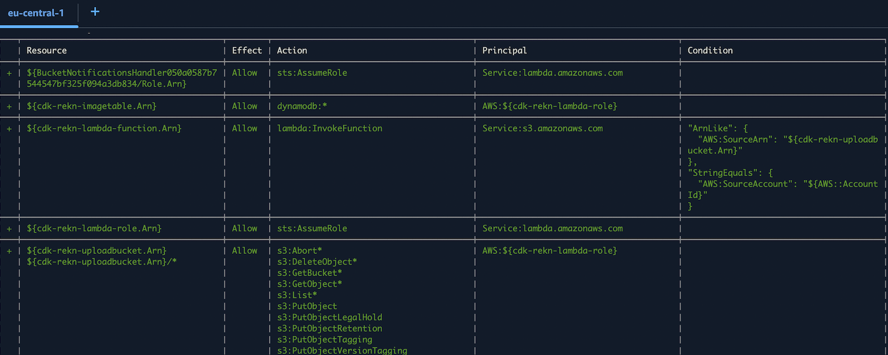
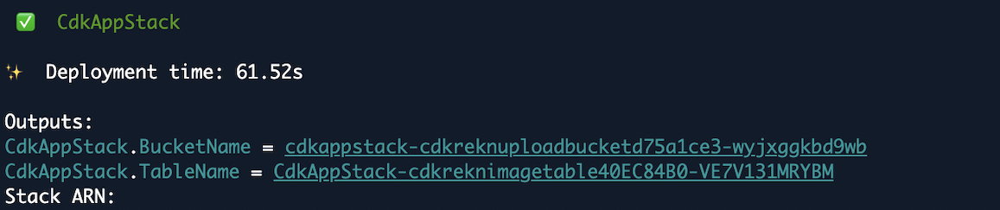

# Analyzing Images Stored in an Amazon S3 Bucket
 
 AWS CDK project uses AWS Lambda, Rekognition, and DynamoDB to detect faces in images uploaded to S3 bucket. The results, including facial attributes, are stored in a DynamoDB table.


## **Architecture**


This solution is built as **Infrastructure as Code (IaC)** using AWS CDK, to define and manage AWS resources programmatically.


**S3 Bucket**

- Acts as the input storage for images.
- Triggers a Lambda function wh

**Lambda**

- Processes S3 events.
- Uses the Rekognition [`detectFaces`](https://docs.aws.amazon.com/rekognition/latest/APIReference/API_DetectFaces.html) API to do facial image analysis.
- Stores the detected labels in DynamoDB.

**Amazon DynamoDB Table**

- Stores metadata about the images and the labels detected by Rekognition.
- Partition key: `Image` (name of the image).

**Amazon Rekognition**

- Stateless API operation`detectFaces` for facial analysis identifies several facial attributes, including:
  - **Age Range**: Estimates the age range of individuals in the image.
  - **Emotions**: Detects emotions like happiness, sadness, surprise, etc. with confidence value
  ```bash
  "Emotions": [
            {
               "Confidence": number,
               "Type": "string"
            }
  ]
  ```
  - **Smile**: Identifies if the person is smiling.


## **IaC**

```bash
cdk-app/
├── lambda/
│   ├── index.mjs #Lambda function for image analysis
├── bin/
│   ├── cdk-app.js #Entry script that initializes the CDK application
├── lib/
│   ├── cdk-app-stack.js #Contains the stack definitions and resource configurations
├── cdk.json #CDK configuration
├── package.json
├── package-lock.json
├── node_modules/ # Local dependencies (installed via npm install)
├── jest.config.js
├── README.md
└── test/

```

## Setting Up 


**Install AWS CDK**
```bash
npm install -g aws-cdk@latest
#or
npm install -g aws-cdk
```
**Verify Installation**

```bash
cdk --version
```

**Create dir cdk-app/**, changing name will cause an error

```bash
mkdir cdk-app
cd cdk-app/
```

**Initialize the application**

```bash
cdk init app --language javascript
```

**Create Lambda Directory**

```bash
mkdir lambda
cd lambda
touch index.mjs
```

**Add layer for aws-sdk**

Lambda layer should be in the same region where you are synthesizing and deploying the CDK stack.
Retrieve the context value from the cdk.json file.

- Add the ARN to cdk.json file under the `context` section, like this:
- Reference it in your stack code with this.node.tryGetContext().

```json
{
  "context": {
    "lambdaLayerArn": "arn:aws:lambda:region:account-id:layer:layer-name:version"
  }
}
```

**Update cdk-app-stack.js**

```bash
cd .. # to the dir with cdk.json
run cdk bootstrap
```




**Optionally Generate the CloudFormation Template**


To inspect the CloudFormation template:

```bash
cdk synth
# Or save the template to a file
cdk synth > template.yaml
```

**Deploy the stack**

```bash
cdk deploy
```



**Cleaning Up**

To delete the deployed stack and resources first **empty the S3 bucket** ⚠️

```bash
cdk destroy
```
